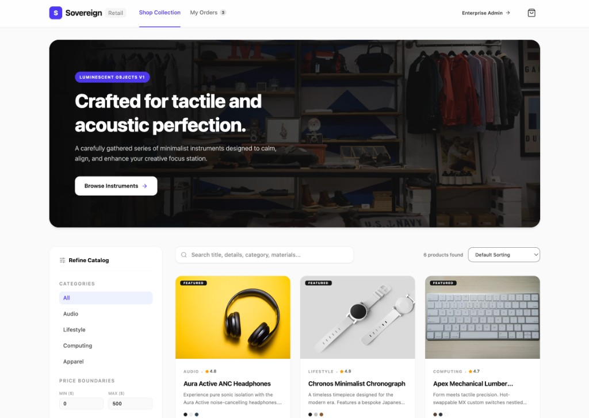

# Full-Stack E-Commerce Platform

<p align="center">
  <a href="https://full-stack-e-commerce-platform-507307610839.europe-west2.run.app"><strong>🚀 Live Demo</strong></a>
  &nbsp;·&nbsp;
  <a href="https://github.com/Vera93203/full-stack-e-commerce-platform"><strong>📦 Source Code</strong></a>
</p>

<p align="center">
  <a href="https://full-stack-e-commerce-platform-507307610839.europe-west2.run.app">
    
  </a>
  
  
  
  
</p>

<p align="center">
  <strong>Sovereign Retail</strong> — a production-style full-stack e-commerce app with a polished customer storefront and an enterprise admin console.
</p>

<p align="center">
  <a href="https://full-stack-e-commerce-platform-507307610839.europe-west2.run.app">
    
  </a>
</p>

<p align="center">
  <em>Click the image to open the live app</em>
</p>

---

## Live demo

| | |
|---|---|
| **Storefront** | [full-stack-e-commerce-platform-507307610839.europe-west2.run.app](https://full-stack-e-commerce-platform-507307610839.europe-west2.run.app) |
| **Admin console** | Open the live app → click **Enterprise Admin** in the header |
| **Hosted on** | [Google Cloud Run](https://cloud.google.com/run) (europe-west2) |

### What to try on the live site

1. **Browse** — filter by category (Audio, Lifestyle, Computing, Apparel), price range, and rating; use search and sorting.
2. **Shop** — open a product, pick color/size, add to cart, and complete checkout (simulated Stripe).
3. **Orders** — view **My Orders** after checkout.
4. **Admin** — switch to **Enterprise Admin** for dashboard metrics, product CRUD, order management, refunds, and analytics.

---

## Highlights

| Area | Capabilities |
|------|----------------|
| **Storefront** | Hero banner, faceted filters, debounced search, product modals, cart (`localStorage`), checkout, order history |
| **Admin** | Revenue dashboard, product editor with image upload, bulk actions, CSV export, order status & refunds |
| **API** | REST endpoints for products, orders, analytics; stock validation; inventory sync on refund |
| **UX** | React 19, Tailwind CSS v4, Motion animations, Lucide icons |

---

## Tech stack

| Layer | Technology |
|-------|------------|
| Frontend | React 19, TypeScript, Tailwind CSS 4, Motion |
| Backend | Express 4, Node.js |
| Build | Vite 6, esbuild |
| Data | JSON file store (`database.json`) |
| Deploy | Google Cloud Run |

---

## Quick start (local)

**Prerequisites:** Node.js 18+

```bash
git clone https://github.com/Vera93203/full-stack-e-commerce-platform.git
cd full-stack-e-commerce-platform
npm install
npm run dev
```

Open **http://localhost:3000**

Optional: copy `.env.example` to `.env` and set `GOOGLE_MAPS_PLATFORM_KEY` for address autocomplete at checkout.

---

## Scripts

| Command | Description |
|---------|-------------|
| `npm run dev` | Dev server (API + Vite) on port **3000** |
| `npm run build` | Production build (`dist/` + bundled server) |
| `npm start` | Run production server |
| `npm run lint` | TypeScript check |

```bash
npm run build
NODE_ENV=production npm start
```

---

## API overview

Base URL: same origin as the app (`/api/...`)

| Method | Endpoint | Description |
|--------|----------|-------------|
| `GET` | `/api/health` | Health check |
| `GET` | `/api/products` | List/filter products |
| `GET` | `/api/products/:id` | Product details |
| `POST` | `/api/products` | Create product |
| `PUT` | `/api/products/:id` | Update product |
| `DELETE` | `/api/products/:id` | Delete product |
| `GET` | `/api/orders` | List orders |
| `POST` | `/api/orders` | Place order |
| `POST` | `/api/orders/:id/status` | Update status |
| `POST` | `/api/orders/:id/refund` | Refund & restock |
| `GET` | `/api/analytics` | Admin metrics |

---

## Project structure

```text
├── server.ts                 # Express API + static/Vite serving
├── server/db.ts              # JSON DB, seeds, analytics
├── src/
│   ├── App.tsx
│   ├── components/
│   │   ├── Storefront.tsx    # Shop, cart, checkout
│   │   └── AdminPanel.tsx    # Dashboard, CRUD, analytics
│   └── types.ts
├── docs/screenshots/         # README assets
└── package.json
```

---

## Deployment

The live demo runs on **Google Cloud Run**:

**https://full-stack-e-commerce-platform-507307610839.europe-west2.run.app**

Build and run locally for other hosts (Render, Railway, Fly.io, etc.):

```bash
npm run build
NODE_ENV=production npm start
```

> **Demo note:** Payments and emails are simulated. The admin panel has no auth — suitable for portfolios and learning, not public production without hardening.

---

## Roadmap

- [ ] PostgreSQL / MongoDB
- [ ] Real Stripe Checkout
- [ ] Admin authentication
- [ ] Customer accounts

---

## License

Apache-2.0 (`SPDX-License-Identifier: Apache-2.0`)

---

## Author

**[Vera93203](https://github.com/Vera93203)**

- **Repository:** [github.com/Vera93203/full-stack-e-commerce-platform](https://github.com/Vera93203/full-stack-e-commerce-platform)
- **Live demo:** [full-stack-e-commerce-platform-507307610839.europe-west2.run.app](https://full-stack-e-commerce-platform-507307610839.europe-west2.run.app)
